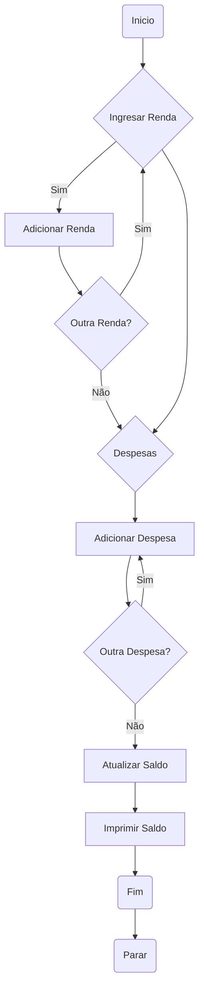

```mermaid
graph TD
    A(Inicio) --> B{Ingresar Renda}
    B --> |Sim| C[Adicionar Renda]
    C --> D{Outra Renda?}
    D --> |Sim| B
    D --> |Não| E{Despesas}
    E --> F[Adicionar Despesa]
    F --> G{Outra Despesa?}
    G --> |Sim| F
    G --> |Não| H[Atualizar Saldo]
    H --> I[Imprimir Saldo]
    I --> J(Fim)
    B --> E
    J --> K(Parar)

```
